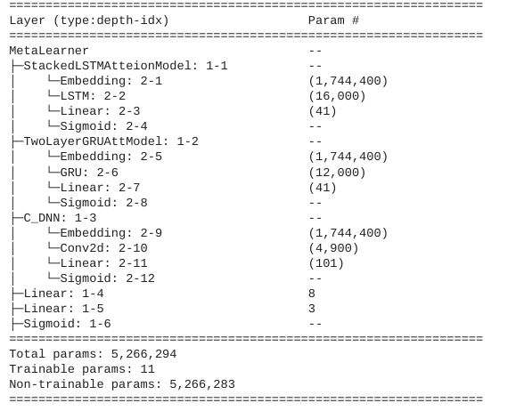
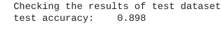

# Stacked-Ensemble-CBOW-Model:
Implementation of a Stacked Ensemble Continuous Bag of Word Model(i.e. CBOW of Word2Vec), in which the Meta-Learner is made up of three different sub-models: 1) a one-dimensional CNN  2) a Stacked Bidirectional-Gru with Attention and 3) a Stacked Bidirectional-Lstm with Attention. The summary of the model architecture is below: 

# Training Summary:

The meta model was trained for 20 epochs using the variable_test_set.csv file and the sub-models were trained on the variable_level_zero.csv. C_Dnn was trained for 27 epochs as seen in training_C-DNN_Model.txt; the two layer GRU with attention model was trained for 7 epochs as seen in training_StackedGRUAttention_Model.txt: and the two layer LSTM with attention model was trained for 7 epochs as seen in training_StackedLSTMAttention_Model.txt. All sub-models used a 32 batch size.

# Testing Results of Meta-Model:

